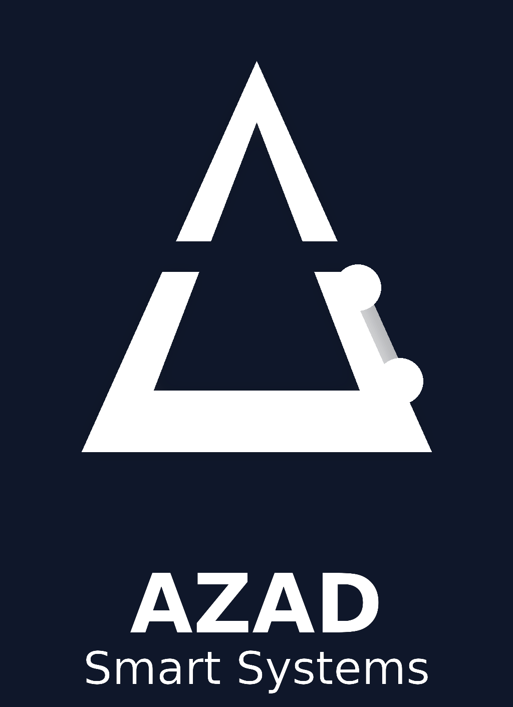

# 🇵🇸 Gangs of Palestine (عصابات فلسطين)



## 📌 نبذة عن المشروع | About the Project
**عصابات فلسطين** هي لعبة استراتيجية نصية (Text-based RPG) متطورة تحاكي حياة الجريمة المنظمة بأسلوب واقعي ومثير. تم بناء اللعبة باستخدام أحدث تقنيات الويب لتقديم تجربة مستخدم سلسة وتفاعلية.

**Gangs of Palestine** is an advanced text-based RPG strategy game that simulates the life of organized crime in a realistic and exciting way. Built with modern web technologies to provide a seamless and interactive user experience.

---

## 🌟 المميزات | Features
- **نظام الجرائم (Crimes System)**: جرائم فردية ومنظمة تتطلب تخطيطاً واستراتيجية.
- **العصابات (Gangs)**: إنشاء عصابات، حروب شوارع، والسيطرة على المناطق.
- **الاقتصاد (Economy)**: سوق سوداء، غسيل أموال عبر البورصة، وبنك مركزي.
- **المعارك (Combat)**: نظام قتال متطور يعتمد على الإحصائيات (القوة، السرعة، الذكاء).
- **التواصل (Social)**: شات عام، منتديات نقاش، ورسائل خاصة.
- **تصميم فاخر (Luxury Design)**: واجهة مستخدم احترافية تدعم الوضع الليلي (Dark Mode) واللغة العربية/النجليزية.

---

## 🛠️ التقنيات المستخدمة | Tech Stack
- **Backend**: Python 3.x, Flask, SQLAlchemy
- **Frontend**: HTML5, CSS3, JavaScript, Bootstrap 4, AdminLTE 3
- **Database**: SQLite / PostgreSQL
- **Security**: CSRF Protection, Bcrypt Hashing, Secure Session Management

---

## 🚀 التشغيل | Installation

1. **استنساخ المستودع (Clone)**:
   ```bash
   git clone https://github.com/yourusername/GangsOfPalestine.git
   cd GangsOfPalestine
   ```

2. **تثبيت المتطلبات (Install Requirements)**:
   ```bash
   pip install -r requirements.txt
   ```

3. **تهيئة قاعدة البيانات (Setup Database)**:
   ```bash
   python seed_full_data.py
   ```

4. **تشغيل السيرفر (Run Server)**:
   ```bash
   python run.py
   ```
   أو
   ```bash
   flask run
   ```

---

## ⚖️ الاتفاقية القانونية وحقوق الاستخدام | Legal Agreement & License

### ⚠️ هام جداً - تحذير قانوني | IMPORTANT LEGAL WARNING

**جميع الحقوق محفوظة © 2024 - 2025 لمطوري مشروع Gangs of Palestine.**
**All Rights Reserved © 2024 - 2025 to Gangs of Palestine Developers.**

1. **الملكية الفكرية (Intellectual Property)**:
   هذا الكود المصدري (Source Code)، التصاميم، قاعدة البيانات، والأفكار الواردة في هذا المشروع هي ملكية فكرية خاصة. يمنع نسخها، إعادة توزيعها، أو استخدامها لأغراض تجارية دون إذن كتابي صريح.

2. **الاستخدام التجاري (Commercial Use)**:
   - يمنع منعاً باتاً بيع هذا السورس كود أو جزء منه لأي طرف ثالث.
   - يمنع استخدام هذا النظام لإنشاء خدمة منافسة دون الحصول على رخصة تجارية (Commercial License).

3. **ترخيص الشراء (Purchase License)**:
   - في حال شرائك للنسخة الكاملة (SaaS License) بقيمة **10,000 دولار**، يحق لك استخدام النظام وتشغيله والربح منه، ولكن **لا يحق لك إعادة بيع الكود المصدري** لطرف آخر.

4. **المسؤولية (Liability)**:
   - المطورون غير مسؤولين عن أي استخدام غير قانوني لهذا النظام. اللعبة مخصصة للأغراض الترفيهية فقط.

**أي انتهاك لهذه الشروط سيعرض الفاعل للملاحقة القانونية وفقاً لقوانين حماية الملكية الفكرية والجرائم الإلكترونية.**

---

## 📞 التواصل والدعم | Contact & Support

للحصول على رخصة التشغيل التجارية أو شراء السورس كود الكامل، يرجى التواصل معنا مباشرة:

- **WhatsApp**: [+970598953362](https://wa.me/970598953362)
- **Email**: support@gangsofpalestine.com

---
*Developed with ❤️ by Professional Developers.*
